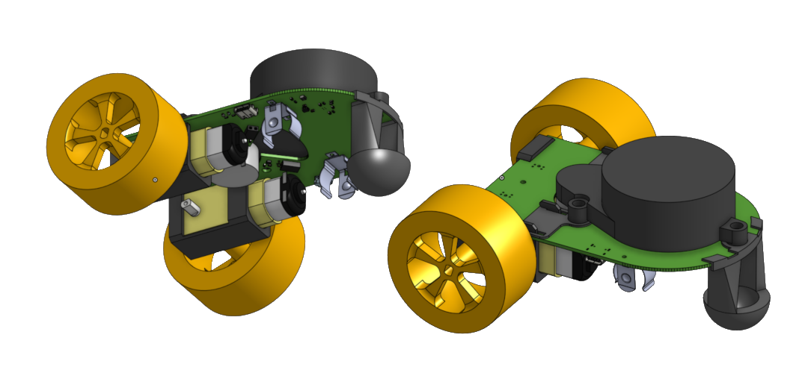

# Little Red Rover Hardware

  

Little red rover was designed using OnShape and KiCAD (
[OnShape project](https://cad.onshape.com/documents/3c9bcb798eb55dc89c3300c0/w/50990f614f9cfbc3dc016690/e/81981a5257c68cf876fffafa?renderMode=0&uiState=662964f9611b155af71d904d), [KiCAD project](https://github.com/usedhondacivic/little_red_rover/tree/main/HARDWARE/little_red_rover)
).
